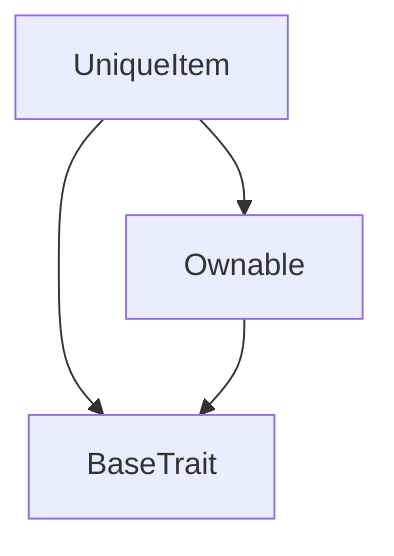
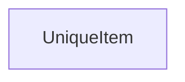

# Tact compilation report
Contract: UniqueItem
BoC Size: 846 bytes

## Structures (Structs and Messages)
Total structures: 31

### DataSize
TL-B: `_ cells:int257 bits:int257 refs:int257 = DataSize`
Signature: `DataSize{cells:int257,bits:int257,refs:int257}`

### SignedBundle
TL-B: `_ signature:fixed_bytes64 signedData:remainder<slice> = SignedBundle`
Signature: `SignedBundle{signature:fixed_bytes64,signedData:remainder<slice>}`

### StateInit
TL-B: `_ code:^cell data:^cell = StateInit`
Signature: `StateInit{code:^cell,data:^cell}`

### Context
TL-B: `_ bounceable:bool sender:address value:int257 raw:^slice = Context`
Signature: `Context{bounceable:bool,sender:address,value:int257,raw:^slice}`

### SendParameters
TL-B: `_ mode:int257 body:Maybe ^cell code:Maybe ^cell data:Maybe ^cell value:int257 to:address bounce:bool = SendParameters`
Signature: `SendParameters{mode:int257,body:Maybe ^cell,code:Maybe ^cell,data:Maybe ^cell,value:int257,to:address,bounce:bool}`

### MessageParameters
TL-B: `_ mode:int257 body:Maybe ^cell value:int257 to:address bounce:bool = MessageParameters`
Signature: `MessageParameters{mode:int257,body:Maybe ^cell,value:int257,to:address,bounce:bool}`

### DeployParameters
TL-B: `_ mode:int257 body:Maybe ^cell value:int257 bounce:bool init:StateInit{code:^cell,data:^cell} = DeployParameters`
Signature: `DeployParameters{mode:int257,body:Maybe ^cell,value:int257,bounce:bool,init:StateInit{code:^cell,data:^cell}}`

### StdAddress
TL-B: `_ workchain:int8 address:uint256 = StdAddress`
Signature: `StdAddress{workchain:int8,address:uint256}`

### VarAddress
TL-B: `_ workchain:int32 address:^slice = VarAddress`
Signature: `VarAddress{workchain:int32,address:^slice}`

### BasechainAddress
TL-B: `_ hash:Maybe int257 = BasechainAddress`
Signature: `BasechainAddress{hash:Maybe int257}`

### ChangeOwner
TL-B: `change_owner#819dbe99 queryId:uint64 newOwner:address = ChangeOwner`
Signature: `ChangeOwner{queryId:uint64,newOwner:address}`

### ChangeOwnerOk
TL-B: `change_owner_ok#327b2b4a queryId:uint64 newOwner:address = ChangeOwnerOk`
Signature: `ChangeOwnerOk{queryId:uint64,newOwner:address}`

### MakeNewUser
TL-B: `make_new_user#dc6a8b83 name:^string deliveryAddress:^string id:int257 = MakeNewUser`
Signature: `MakeNewUser{name:^string,deliveryAddress:^string,id:int257}`

### ChangeUserData
TL-B: `change_user_data#7f22ed74 name:^string deliveryAddress:^string = ChangeUserData`
Signature: `ChangeUserData{name:^string,deliveryAddress:^string}`

### CreateShop
TL-B: `create_shop#c6366b42 shopName:^string = CreateShop`
Signature: `CreateShop{shopName:^string}`

### AddItem
TL-B: `add_item#fe3511b0 isUnique:bool content:^string price:coins = AddItem`
Signature: `AddItem{isUnique:bool,content:^string,price:coins}`

### NftTransfer
TL-B: `nft_transfer#d9f8bfac newOwner:address isSalable:bool = NftTransfer`
Signature: `NftTransfer{newOwner:address,isSalable:bool}`

### NftTransferNotification
TL-B: `nft_transfer_notification#591763ee itemIndex:int257 oldOwner:address newOwner:address = NftTransferNotification`
Signature: `NftTransferNotification{itemIndex:int257,oldOwner:address,newOwner:address}`

### CreateOrder
TL-B: `create_order#7ac14988 itemAddress:address deliveryAddress:^string price:coins = CreateOrder`
Signature: `CreateOrder{itemAddress:address,deliveryAddress:^string,price:coins}`

### SetPrice
TL-B: `set_price#9b6fea82 newPrice:coins isSalable:bool = SetPrice`
Signature: `SetPrice{newPrice:coins,isSalable:bool}`

### SetUniqueItemPrice
TL-B: `set_unique_item_price#c46fecd7 uniqueItem:address newPrice:coins = SetUniqueItemPrice`
Signature: `SetUniqueItemPrice{uniqueItem:address,newPrice:coins}`

### GetPrice
TL-B: `get_price#fdc52c75  = GetPrice`
Signature: `GetPrice{}`

### GetPriceResponse
TL-B: `get_price_response#7c95a1fc price:coins = GetPriceResponse`
Signature: `GetPriceResponse{price:coins}`

### NftTransferSuccess
TL-B: `nft_transfer_success#e6e77cc0  = NftTransferSuccess`
Signature: `NftTransferSuccess{}`

### OrderCompleted
TL-B: `order_completed#993e1ed5 orderIndex:int257 itemAddress:address buyer:address = OrderCompleted`
Signature: `OrderCompleted{orderIndex:int257,itemAddress:address,buyer:address}`

### MakeOrder
TL-B: `make_order#75bc02e6 itemAddress:address price:coins = MakeOrder`
Signature: `MakeOrder{itemAddress:address,price:coins}`

### NewOrder
TL-B: `new_order#90268e31 deliveryAddress:^string itemIndex:uint256 price:coins = NewOrder`
Signature: `NewOrder{deliveryAddress:^string,itemIndex:uint256,price:coins}`

### Shop$Data
TL-B: `_ parent:address owner:address shopName:^string uniqueItemsCount:uint256 shopId:uint256 ordersCount:uint256 balance:coins = Shop`
Signature: `Shop{parent:address,owner:address,shopName:^string,uniqueItemsCount:uint256,shopId:uint256,ordersCount:uint256,balance:coins}`

### UniqueItem$Data
TL-B: `_ shop:address owner:address content:^string index:uint256 price:coins isSalable:bool = UniqueItem`
Signature: `UniqueItem{shop:address,owner:address,content:^string,index:uint256,price:coins,isSalable:bool}`

### Order$Data
TL-B: `_ seller:address buyer:address itemAddress:address id:uint256 price:coins priceSetted:bool completed:bool refunded:bool = Order`
Signature: `Order{seller:address,buyer:address,itemAddress:address,id:uint256,price:coins,priceSetted:bool,completed:bool,refunded:bool}`

### ShopFactory$Data
TL-B: `_ owner:address shopsCount:uint256 = ShopFactory`
Signature: `ShopFactory{owner:address,shopsCount:uint256}`

## Get methods
Total get methods: 4

## price
No arguments

## index
No arguments

## content
No arguments

## owner
No arguments

## Exit codes
* 2: Stack underflow
* 3: Stack overflow
* 4: Integer overflow
* 5: Integer out of expected range
* 6: Invalid opcode
* 7: Type check error
* 8: Cell overflow
* 9: Cell underflow
* 10: Dictionary error
* 11: 'Unknown' error
* 12: Fatal error
* 13: Out of gas error
* 14: Virtualization error
* 32: Action list is invalid
* 33: Action list is too long
* 34: Action is invalid or not supported
* 35: Invalid source address in outbound message
* 36: Invalid destination address in outbound message
* 37: Not enough Toncoin
* 38: Not enough extra currencies
* 39: Outbound message does not fit into a cell after rewriting
* 40: Cannot process a message
* 41: Library reference is null
* 42: Library change action error
* 43: Exceeded maximum number of cells in the library or the maximum depth of the Merkle tree
* 50: Account state size exceeded limits
* 128: Null reference exception
* 129: Invalid serialization prefix
* 130: Invalid incoming message
* 131: Constraints error
* 132: Access denied
* 133: Contract stopped
* 134: Invalid argument
* 135: Code of a contract was not found
* 136: Invalid standard address
* 138: Not a basechain address
* 4429: Invalid sender
* 19553: Order already completed
* 24546: Invalid data
* 24590: Price not setted yet
* 27283: Item has been refunded for some reason
* 32501: Only seller can refund the item
* 32819: Item not salable yet
* 46647: Insufficient payment

## Trait inheritance diagram

## Contract dependency diagram

